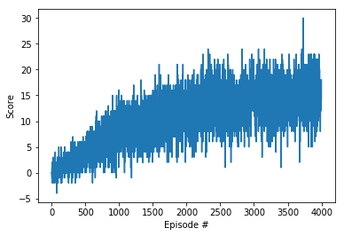

# Project report
## Learning algirithm
I went for a relatively plain Deep Q Learning algorithm, as it is described in the original paper. The input vector was the state, instead of image of the world, which also means that the input layer in the network is a fully connected layer. The network design look like this:
- Input layer: 37 nodes in, 28 nodes out
- Hidden layer: 128 nodes in, 64 out
- Output layer: 64 nodes in, 5 out

Parameters used in the DQN training:
- Maximum steps per episode: 1000
- Epsilon start: 1.0
- Epsilon end: 0.1
- Epsilon decay rate: 0.999
- Replay buffer size: 10000
- Training mini batch size: 64
- Learning rate: 5e-4

## Result Training

```
Episode 100	Average Score: 0.17
Episode 200	Average Score: 0.92
Episode 300	Average Score: 1.57
Episode 400	Average Score: 2.11
Episode 500	Average Score: 2.99
Episode 600	Average Score: 4.19
Episode 700	Average Score: 5.34
Episode 800	Average Score: 6.42
Episode 900	Average Score: 6.61
Episode 1000	Average Score: 7.64
Episode 1100	Average Score: 7.95
Episode 1200	Average Score: 8.73
Episode 1300	Average Score: 8.95
Episode 1400	Average Score: 9.51
Episode 1500	Average Score: 9.07
Episode 1600	Average Score: 9.76
Episode 1700	Average Score: 11.01
Episode 1800	Average Score: 11.42
Episode 1900	Average Score: 11.60
Episode 2000	Average Score: 11.58
Episode 2100	Average Score: 11.94
Episode 2200	Average Score: 12.02
Episode 2245	Average Score: 13.01
Acceptable score in 2145 episodes!	Average Score: 13.01
Episode 2300	Average Score: 13.11
Episode 2400	Average Score: 13.94
Episode 2500	Average Score: 13.95
Episode 2600	Average Score: 13.51
Episode 2700	Average Score: 13.05
Episode 2800	Average Score: 12.81
Episode 2900	Average Score: 13.61
Episode 3000	Average Score: 15.07
Episode 3100	Average Score: 14.36
Episode 3200	Average Score: 14.66
Episode 3300	Average Score: 13.84
Episode 3400	Average Score: 14.61
Episode 3500	Average Score: 14.60
Episode 3600	Average Score: 15.00
Episode 3700	Average Score: 14.78
Episode 3800	Average Score: 15.11
Episode 3900	Average Score: 16.07
Episode 4000	Average Score: 15.03
```

## Result running
```
Episode 100	Average Score: 15.01
```

## Future improvements
1. Optimize hyperparameters further
2. Double Deep Q Network
3. Learning from pixels