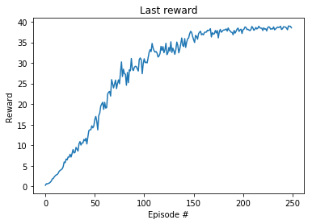
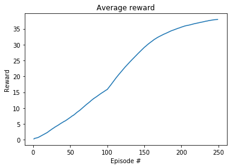

# Project report
## Learning algirithm
The chosen algorithm was Proximal Policy Optimization (PPO), modified for continous action space. The input was the observation vectors (33), and the model consists of two neural networks: actor and critic (`PPOPolicyNetwork`).

Input to the actor network is the observations, and it outputs actions. While the critic network computes average returns used for state value estimation.

## Networks
The actor network outputs a value for all the 4 actions. In the original PPO algorithm, there is no critic network, but it is very usefull to calculate estimation for state.

## Actor network
- 3 layers
- Input: 33 nodes (ReLU)
- Hidden: 512 nodes (ReLU)
- Ouput: 4 nodes (tanh)

## Critic network
- 3 layers
- Input: 33 nodes (ReLU)
- Hidden: 512 nodes (ReLU)
- Output: 1 nodes (output value used without activation)

## Hyperparameters
Parameters used in the PPO training:
- Discount rate: 0.99
- Tau: 0.95
- Rollout Length: 2048
- Batch Size: 32
- Episodes: 250
- Learning rate: 3e-4

## Training Results
The following charts shows the last reward, and the average reward for each training step. The graphs shows a steady learning, and it passes the required score of 30 after about 235 episodes.



```
Episode: 250 Total score: 38.5364991386421 Last 100 average: 37.90468415276427
```

Model is saved in the file `ppo.pth`.

## Running Results
When testing the policy for a separate run, the following score is received:
```
38.75849913368002
```

## Future improvements
1. Optimize hyperparameters further
2. D4PG
3. A3C
4. Compare PPO, D4PG and A3C