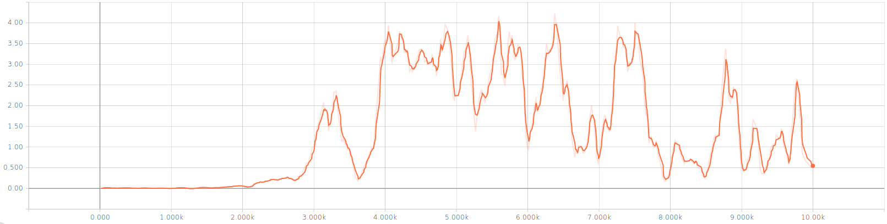

# Project report

## Learning algorithm
The chosen learning algorithm was Multi Agent Deep Determenistic Policy Gradients (MADDPG) with some modifications.

The actor takes observation as input, and outputs actions to take. While the critic is used to compute state-action values.

## Networks
### Actor network
- 4 layers
- Input: 24 nodes (ReLU)
- Hidden 1: 256 nodes (ReLU)
- Hidden 2: 256 nodes (ReLU)
- Ouput: 2 nodes (tanh)
- Learning rate: 1e-3

### Critic network
- 3 layers
- Input: 52 nodes (ReLU)
- Hidden: 512 nodes (ReLU)
- Output: 1 nodes (output value used without activation)
- Learning rate: 1e-4

## Hyperparameters
Parameters used in the PPO training:
- Discount rate: 0.99
- Tau: 0.001
- Buffer size: 100k
- Batch Size: 128
- Episodes: 10k
- Update frequency: 2

## Modifications
I struggled to get good results with just the OUNoise class, so I found inspiration from other students which had implemented more random noise. I implemented this approach, and ran 100% random actions for the first 1000 episodes, just to build up the replay buffer. And then 50% random actions for the next 1000 episodes. Following by 0% random actions after 2000 episodes. This gave much better results.

## Training Results (TODO)
The following charts shows the last reward, and the average reward for each training step. Because of the random modification, no good results can be expected for the first 2000 episodes.
After episode 2000, the graph shows a steady growThe graphs shows a steady learning, and it passes the required score of 0.5 after about 2900 episodes. The graph also shows a jump up and down, but this is to be expected.

Model is saved in the files `models/score_4.30_x_y.weights`.

## Future improvements
1. Optimize hyperparameters
2. Try to get rid of the random action in the start of the training
3. MAPPO